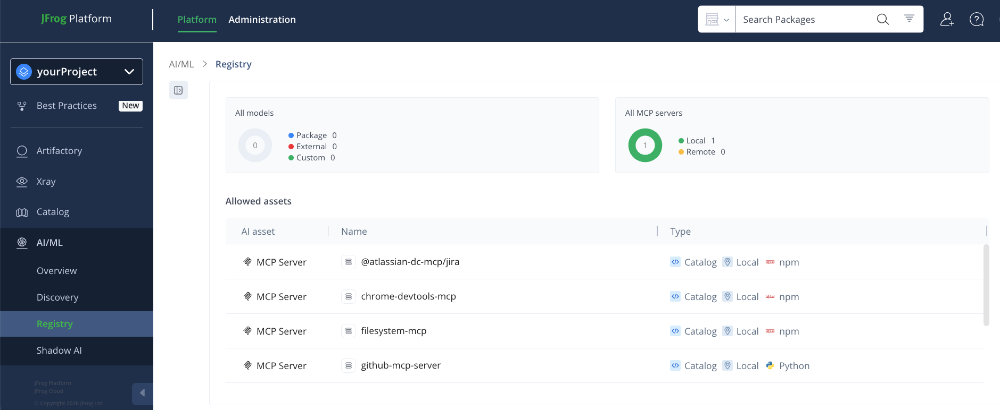
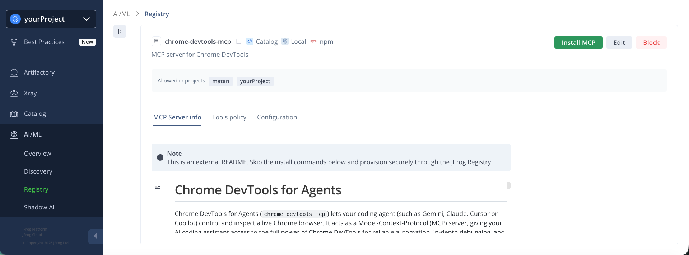
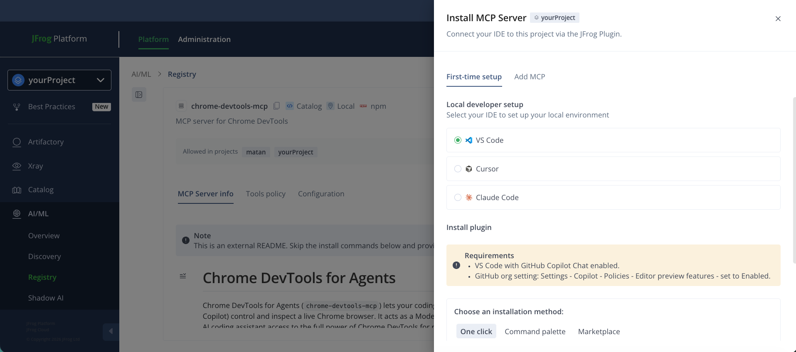

# JFrog MCP Integration for VS Code

JFrog integration for [Visual Studio Code](https://code.visualstudio.com/) and **GitHub Copilot Chat** — connect your Copilot agent to the **JFrog Agent Guard** for policy-governed MCP access.
<br>
The **JFrog Agent Guard** is a local proxy that wraps each MCP server and enforces your organization's tool policies on every agent call.
<br>
Once installed, your Copilot agent can discover and use MCP servers from the **JFrog MCP Registry** with no manual configuration required.

---

## Prerequisites

Before installing, make sure you have:

- **JFrog Platform access** — An active account with the AI Catalog enabled.
- **JFrog project** — At least one MCP server allowed for your project.
- **JFrog host URL and access token** — Your JFrog platform URL and a valid access token.
- **VS Code** — With the **GitHub Copilot Chat** extension installed and signed in.
- **GitHub Copilot editor preview features enabled** — In your GitHub organization settings, navigate to **Settings → Copilot → Policies → Editor preview features** and set it to **Enabled**.
- **Node.js** (≥ 18) — with `npx` on your `PATH` — required so the `mcp-gateway` can be fetched on demand.
- **JFrog CLI** (≥ 2.x, optional) — Recommended for `jf config add` authentication (see [Authentication](#authentication)).
- **JFrog credentials** — Provided in one of two ways (see [Authentication](#authentication)):
---

## Installation

You have three options for installing the plugin in VS Code. Pick whichever fits your workflow.

### Option 1 — Magic link (recommended)

From the JFrog Platform, navigate to **AI/ML → Registry → Your Project → MCP Servers**:



Select an MCP server, then click **Install MCP**:



Choose **VS Code** as your IDE, then click **Install via magic link**:



Alternatively, open this link in any browser:

```
vscode://chat-plugin/install?source=jfrog/vscode-plugin
```

VS Code opens, prompts you to install the plugin, and asks you to **Trust** the source.

### Option 2 — Install from source via the command palette

1. Open the Quick Open palette (`Cmd+Shift+P` on macOS or `Ctrl+Shift+P` on Windows/Linux).
2. Run **Chat: Install Plugin from Source**.
3. When prompted, enter:
   ```
   https://github.com/jfrog/vscode-plugin/
   ```
4. Click **Trust**.

### Option 3 — Add the marketplace to your VS Code settings

1. Open your user `settings.json` (`Cmd+Shift+P` → **Preferences: Open User Settings (JSON)**).
2. Add the following entry inside the top-level `{ ... }` object (don't forget a trailing comma if it isn't the last entry):
   ```json
   {
     "chat.plugins.marketplaces": [
       "https://github.com/jfrog/vscode-plugin/"
     ]
   }
   ```
3. Open the Extensions panel (`Cmd+Shift+X`) and search for `@agentPlugins jfrog/vscode-plugin`.
4. Select the plugin, click **Install**, and click **Trust** if prompted.

---

## Authentication

The plugin reads JFrog credentials from environment variables or the JFrog CLI configuration. Pick **one** of the following.

### Option A — JFrog CLI (`jf config add`)

If you already have the JFrog CLI installed and configured, the plugin uses your existing authentication — no further setup is required.

**First-time setup only** (if you have never configured the JFrog CLI on this machine):

1. Open your terminal.
2. Run:
   ```bash
   jf config add
   ```
3. Follow the interactive prompts to enter your JFrog Platform URL and access token.
4. Restart your IDE / terminal to apply the changes.

### Option B — Persistent environment variables

Use this if you are not using the JFrog CLI. Set the following variables in your shell profile (macOS/Linux) or user environment (Windows), then fully restart VS Code:

| Variable             | Description                                                |
| -------------------- | ---------------------------------------------------------- |
| `JFROG_PLATFORM_URL` | Your JFrog platform URL, e.g. `https://mycompany.jfrog.io` |
| `JFROG_ACCESS_TOKEN` | Your JFrog access token                                    |

---

## Usage

After authentication, open a workspace in VS Code. The JFrog Agent Guard starts automatically and the MCP servers approved for your project become available to your Copilot agent. You can interact with the registry through natural language — no terminal commands required.

### Discover, inspect, and install MCPs

| Ask the agent…                                          | What happens                                                                                                                                |
| ------------------------------------------------------- | ------------------------------------------------------------------------------------------------------------------------------------------- |
| "Which MCP servers can I install?"                      | Returns all MCP servers approved for your current project that you can install.                                                             |
| "What MCP servers do I already have?"                   | Returns only the MCP servers already installed on your machine.                                                                             |
| "Show me the details for the filesystem MCP server."    | Returns detailed metadata, required configuration (environment variables, runtime arguments), and active tool policies for a given server. |
| "Add the GitHub MCP server."                            | Installs an approved MCP server and syncs its tool policies locally. Secrets are requested via a CLI command — never in chat.               |
| "Update the environment variables for the Slack MCP."   | Replaces the configuration for an already-installed server without removing and reinstalling it.                                            |
| "Remove the Slack MCP server."                          | Removes the server and its stored credentials from your local setup. Changes apply immediately.                                             |
| "Log in to the remote Jira MCP server using OAuth."     | Authenticates with a remote HTTP-based MCP server (OAuth, API key, or bearer token).                                                        |
| "Log out of the Jira MCP server."                       | Removes stored authentication credentials for a server.                                                                                     |

### How secrets are handled

When an MCP server requires a sensitive configuration, the agent cannot set the value directly. Instead, it returns a CLI command for you to copy and run in your terminal. Secrets such as API keys, tokens, and connection strings are never exposed in the agent chat history.

---

## Troubleshooting

### Copilot isn't using the JFrog Agent Guard

The plugin installs `.github/copilot-instructions.md` on session start. If the file is missing:

1. Confirm the plugin is installed and trusted (`Cmd+Shift+P` → **Chat: Show Installed Plugins**).
2. Reload the VS Code window so the `SessionStart` hook fires again.
3. Check the file `.github/copilot-instructions.md` exists at the workspace root. The hook only writes it if it is absent — to refresh, delete the file and reload.

### MCP failed to start

The plugin does not install runtimes. Ensure you have Docker, Python, or Node installed locally as required by the specific MCP server, and that any required environment variables are configured.

A server reporting **0 tools** (or **"Discovered 0 tools"**) while shown as **Running** in `MCP: List Servers` is **not** a healthy server with no tools — it means the gateway connected but the underlying MCP did not come up. Right-click the server, choose **Show Output**, and read the last lines for the root cause.

### Tools are not appearing in Copilot chat

Permissions are project-specific. Make sure the MCP is allowed for the specific project configured in your environment (`JF_PROJECT`) and that any tool policies are not blocking the tools you expect.

### Authentication failures on a stored secret

For local MCPs configured with `${input:...}` substitution: click the **Clear** CodeLens above the matching entry in `.vscode/mcp.json`'s `inputs` array, then restart the server — VS Code will re-prompt for the secret.

### Previously-working OAuth MCP suddenly failing

The cached refresh token is likely dead. Ask the agent to "log in to the `<MCP_NAME>` MCP server" again; the gateway runs the OAuth flow and overwrites the old tokens in `~/.jfrog/jfrogmcp.conf.json`.

### Uninstall the plugin

Open `Cmd+Shift+P` → **Chat: Manage Installed Plugins**, select the JFrog plugin, and click **Uninstall**. The `SessionStart` hook stops running once the plugin is removed. The `.github/copilot-instructions.md` file is left in place; delete it manually if you no longer want Copilot governed by the JJFrog Agent Guard.

### Getting help

If you continue to experience issues, open a [GitHub issue](https://github.com/jfrog/vscode-plugin/issues) or contact JFrog support at <devrel@jfrog.com>.

---

## Contributing

See [`CONTRIBUTING.md`](CONTRIBUTING.md) for development setup, coding conventions, and the pull-request process.

## Security

See [`SECURITY.md`](SECURITY.md) for how to report vulnerabilities.

## License

Licensed under the [Apache License 2.0](LICENSE).
